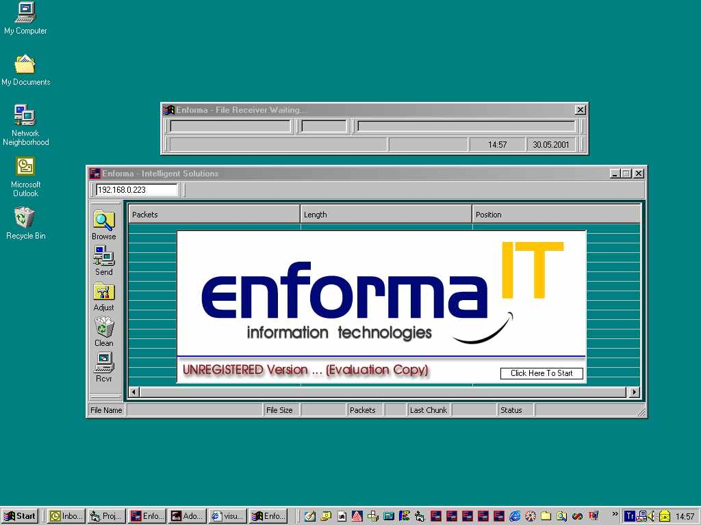



## Complete File Send/Receive  Application

### Description

Sends / Receives thru Socket Connections.

You will be transferring Files thru TCP/IP connections.Users can ADJUST the Data Packet Size to be transferred.Advanced Progress Indicators and a very user friendly design.PLEASE DONT FORGET TO VOTE FOR ME.!..Ps.: Make sure that you have an exisiting "C:\Enforma Systems\Temporary Files" Folder in your C Drive for the files to be stored into.....
 
### More Info
 
No Inputs

A Great Example to get ideas how to establish a SOCKET connection and develop a Socket-T0-Socket / Client/server Application.....

No Returns

NO Side effects--tested in Win9x-WinNT-WinME and Win200

             |
---                |---
**Submitted On**   |2001-05-30 14:59:34
**By**             |[CENGIZ SENSIVAS](https://github.com/Planet-Source-Code/PSCIndex/blob/master/ByAuthor/cengiz-sensivas.md)
**Level**          |Advanced
**User Rating**    |4.4 (35 globes from 8 users)
**Compatibility**  |VB 6\.0
**Category**       |[Internet/ HTML](https://github.com/Planet-Source-Code/PSCIndex/blob/master/ByCategory/internet-html__1-34.md)
**World**          |[Visual Basic](https://github.com/Planet-Source-Code/PSCIndex/blob/master/ByWorld/visual-basic.md)
**Archive File**   |[Complete F202645302001\.zip](https://github.com/Planet-Source-Code/cengiz-sensivas-complete-file-send-receive-application__1-23584/archive/master.zip)

### API Declarations

GetTickCount

